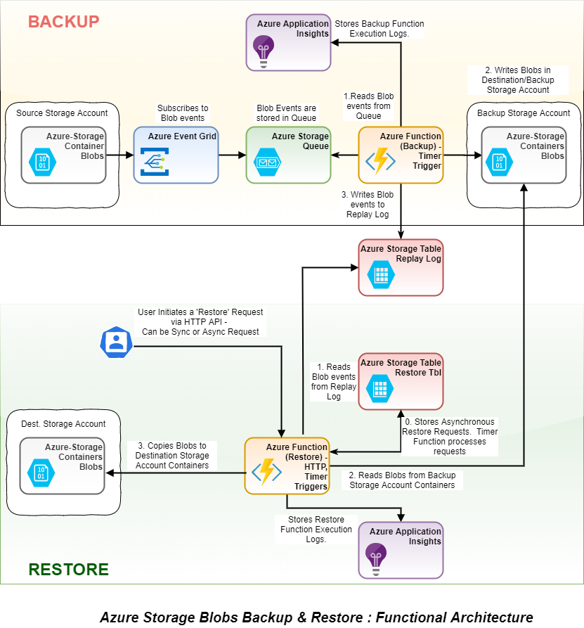
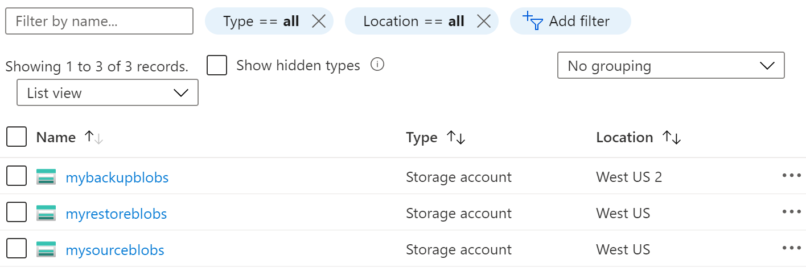

---
Languages:
- C#
Products:
- Azure
Description: "Azure Blob Storage doesn't currently offer an out of box solution for backing up and restoring block blobs."
urlFragment: storage-blob-backup-restore
---

# Backup and Restore Solution for Azure Storage Blobs

Azure Blob Storage currently doesn't offer an out of box solution for backing up and restoring block blobs. This project can be used to perform weekly full and daily incremental back-ups of storage accounts containing block blobs.

In case of a disaster, the solution also provides an option to restore blobs to the specified Storage Account.

Since all components in this solution are Azure's first-party services, important blob properties such as Created & LastModified time, and the **metadata** of each blob object will be preserved during backup and restore.

## Features
This project framework provides the following features:
* Daily Incremental backup of Azure Storage Account
* Restore backup either synchronously or asynchronously

## Functional Architecture

In the following diagram:
* The upper half represents the **BACKUP** workflow of the solution: _Source blobs -> Event Grid -> Queue -> Backup Function -> Backup_.
* The bottom half represents the **RESTORE** workflow: _Initiating restore -> Restore Function reads from Replay logs -> read & copy blobs from Backup storage account to Restore storage account_.
* The _Replay Log_ inside the Table Storage is where all the blob operations are stored and will be _replayed_ during the process to restore blobs.
* Each restore operation is stored in the _Restore Table_.



## Instructions to configure this solution

### Create storage accounts for Source, Backup and Restore
Unless otherwise specified, we use **general-purpose v2** storage accounts in this solution. Storage account **v1** does not support integration with Event Grid.
1. If you don't already have an existing source storage account for your blobs, create a new storage account "_mysourceblobs_". This is the source blob storage you want to protect with this backup solution.
1. Create a new backup storage account "_mybackupblobs_" in a different Azure region from "_mysourceblobs_".
1. In the same Azure region as your source storage account, create a new storage account "_myrestoreblobs_". This is the storage account where we will restore the blobs from backup.
1. You should have 3 storages accounts before proceeding to the next section:


### Configure Storage Queue and Event Grid for blob events

In this section, we will configure Blob events so when there's a CRUD operation to the blobs, it will trigger an event. Blob storage events are pushed using Azure Event Grid to Queue Storage.

1. In your storage account "_mybackupblobs_", create a [Queue Storage](https://docs.microsoft.com/en-us/azure/storage/queues/storage-queues-introduction) to store the event grid events. Please note this storage account containing the storage queue cannot be connected to VNET.


2. Go to your source storage account "_mysourceblobs_". Configure blob events and filter Event Grid event subscription for event types **Blob Created** and **Blob Deleted** (both types are enabled by default).


3. _Alternatively_, you can create an event subscription for the storage account by firing the below command in [Azure Cloud Shell](https://shell.azure.com). Please note, this feature is still in preview and you will have to install the Event Grid extension for Azure CLI. You can install it with _az extension add --name eventgrid_. This step will make sure all the create, replace and delete events are recorded in the configured Azure Storage Queue. **Please note modifications to a BLOB are not recorded hence our solution won’t be able to support the same.**

```
az eventgrid event-subscription create \
--resource-id "/subscriptions/<<subscriptionid>>/resourceGroups/<<resourcegroupname>>/providers/Microsoft.Storage/storageAccounts/<<sourcestorage>>" \
-g "<<resourcegroupname>>" \
--name "<<subscriptionname>>" \
--endpoint-type storagequeue \
--endpoint "/subscriptions/<<subscriptionid>>/resourcegroups/<<resourcegroupname>>/providers/Microsoft.Storage/storageAccounts/<<storageaccountname>>/queueservices/default/queues/<<queuename>>"
```

### Configure Storage Table for Replay logs
Replay logs are the blob operation logs (such as create or delete) stored in Table Storage while the backup blobs are being created. These transactions will be _replayed_ during the process of restoring blobs from backup.

* Create a Table Storage under storage account "_mybackupblobs_":


### Set up .Net Core Projects to perform incremental backup and restore backup.

The sample solution has three projects in it. You can deploy them as Azure Functions.

* ##### backup.core	
This project does not require any modification. It contains the logic of backup, and restore.
* ##### backup.utility	
This contains the main endpoint to start the backup process. This is a continuous running utility and performs the incremental backup every X seconds. It also creates a detailed log for you to monitor the backup process. It uses Serilog and stores the logs in Azure Table Storage. You can change it as needed. Here are the settings which are configurable. Highlighted settings are mandatory to change, the rest can can be left with default values

**Connection Strings**

| Key Name        | Description           |
| ------------- |:-------------| 
| **EventQueueStorage**      | This the connection string to storage account where the Azure Storage queue exists and where the azure storage events are being stored. | 
| **SourceBlobStorage**      | This is the connection string of the source storage account for which the back-up needs to be performed. | 
| **BackupTableStorage**      | This is the connection string of the storage account where the storage events for the incremental backup will be stored. The listener will read the event messages from the storage queue and will store the same here with some additional info. |
| **BackupBlobStorage**      | This is the connection string of the destination storage account where the created/replaced/deleted block blobs are copied. |	

**App Settings**

| Key Name        | Description           |
| ------------- |:-------------| 
| **BackupTableName**      | Create a storage table manually in storage account mentioned in the “BackupTableStorage” connection string and specify the name of the same table here. | 
| **EventQueueName**      | Specify the Name of the event queue created above in “EventQueueStorage” connection string. | 
| QueueVisibilityTimeOutInMS      | Queue visibility time out in milliseconds. The listener must process the messages in this time frame before it starts appearing in the queue again. In case, the messages are processed successfully they won’t appear in storage queue again. | 
| QueueMessageCountToRead      | Defines the number of messages to read in one batch by the listener from the Azure Storage Queue. Please note utility reads another batch of messages only when it’s done processing the existing batch. | 
| BlobSASExpiryInMts      | SAS Key Expiry in Minutes. This is used in case of Server copy.| 
| TimerElapsedInMS      | Timer interval in milliseconds. On this timer click the listener reads the messages from event queue and copies the events metadata to table storage and copies the blobs from source storage account to destination storage account. |
|IsServerCopy|	To perform server copy or Sync copy. In case the storage accounts are in a VNET, you will have to keep this value to false. For server copy you can find more details [here](https://blogs.msdn.microsoft.com/windowsazurestorage/2012/06/12/introducing-asynchronous-cross-account-copy-blob/)| 	
|**Serilog : connectionString**|This is the connection string of the storage account where the detailed diagnostic logs will be generated.| 	

* ##### restore.utility	
This utility is responsible for restoring the incremental back-up. Before the incremental back-up is restored, user will have to create a new storage account manually where the data needs to be restored. User will also have to first move the full back-up using AZCopy to the destination i.e. newly created storage account.
User will have to initiate the restore process manually by giving the start date and end date for which data needs to be restored.
For Example: Restore process reads the data from the table storage for the period 01/08/2018 to 01/10/2018 sequentially to perform the restore. The date format is mm/dd/yyyy

**Connection Strings**

| Key Name        | Description           |
| ------------- |:-------------| 
| **BackupTableStorage**      | This the connection string where you have created the table to store the event metadata. This should be same as “BackupTableStorage” from storage utility. |
| **BackupBlobStorage**      | This is the connection string where the listener is keeping the backup. This should be same as “BackupBlobStorage” from storage utility. |	
| **RestoreBlobStorage**      | This is the connection string of a storage account where the restore will be performed. Please note you will have to first bring the full backup from the “fkbkp” folder using the AzCopy. |	

**App Settings**

| Key Name        | Description           |
| ------------- |:-------------| 
| **BackupTableName**      | Name of the Azure table name where the event metadata has been stored. This should be same as “BackupTableName” from storage utility. |
| BlobSASExpiryInMts      | SAS Key Expiry in Minutes. This is used in case of Server copy.| 
| IsServerCopy      | To perform server copy or Sync copy. In case the storage accounts are in a VNET, you will have to keep this value to false. For server copy you can find more details [here](https://blogs.msdn.microsoft.com/windowsazurestorage/2012/06/12/introducing-asynchronous-cross-account-copy-blob/)|
| **Serilog : connectionString**      | This is the connection string of the storage account where the detailed diagnostic logs will be generated.|

## Resources
- https://docs.microsoft.com/en-us/azure/storage/blobs/storage-blob-event-overview
- https://docs.microsoft.com/en-us/azure/cosmos-db/table-storage-overview

